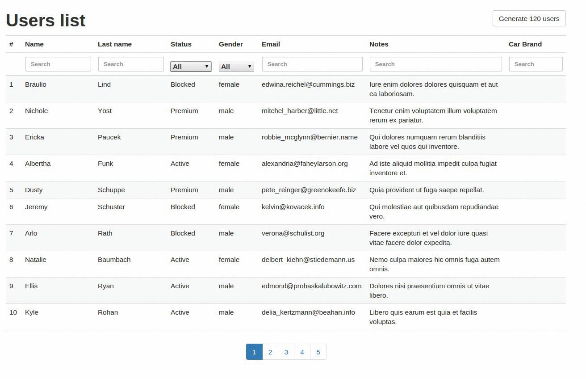
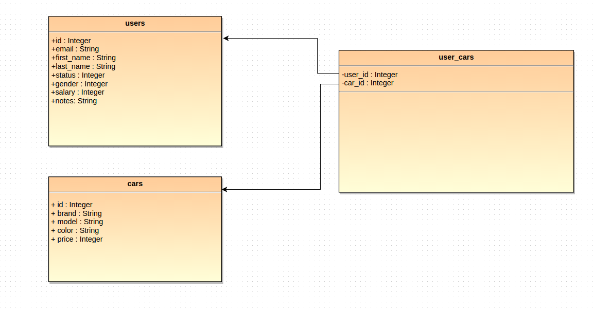

# Gridzzly

## Intro
Gridzzly is small library which allows you to paginate, sort and filter data with slick functional relation mapper.
Current version works with slick and Play Framework. It could be used for easier integration with frontend tables. This project example:
 
   

## Setup

1. Clone this repository:
    ```
    git clone https://github.com/JAVEO/gridzzly-example.git
    ```
2. Go to griddzly-example and run server:

    ```
    cd gridzzly-example
    activator "run 9001"
    ```
3. Inside /gridzzly-example go to client, install bower and npm components, then run frontend server:
    ```
    cd client
    bower install
    sudo npm install
    sudo grunt serve:watch
    ```

4. Produce some fake data, to do this go to:
    ```
    http://localhost:9001/api/seeds
    ```
    and then you can preview them:
    ```
    http://localhost:9001/api/users
    ```
5. Go to frontend application and play with it:
    ```
    http://localhost:3002/#/users
    ```


## Project details
#### Database
Let's say that you've got following relationship in your database:



User can have many cars and each car can belong to many users. User can also have no cars.

Table users is defined in slick as:

```scala
class UsersTable(tag: Tag) extends Table[User](tag, "users"){
  def id = column[Long]("id", O.PrimaryKey, O.AutoInc)
  def email = column[String]("email")
  def firstName = column[String]("first_name")
  def lastName = column[String]("last_name")
  def status = column[Int]("status")
  def gender = column[Int]("gender")
  def salary = column[Long]("salary")
  def notes = column[String]("notes")

  def * = (id.?, email, firstName, lastName, status, gender,salary, notes) <> ((User.apply _).tupled, User.unapply)
}
```
Example:

|id: Int| email: String | first_name: String   | last_name: String           |status: Int            |gender: Int            | Salary: Int |Notes: String          |
|-------|:-------------:| -------------------- |:-------------------------:  |:---------------------:|:---------------------:|:-----------:|:---------------------:|
|1      |a@a.com        | John                 | Smith                       |1                      |1                      |1000         |some notes...          |
|2      |b@b.com        | Ann                  | Doe                         |2                      |2                      |3000         |some notes...          |
|3      |c@c.com        | Mark                 | Kowalski                    |1                      |1                      |4000         |some notes...          |

Table cars is defined in slick:

```scala
class CarsTable(tag: Tag) extends Table[Car](tag, "cars"){
  def id = column[Long]("id", O.PrimaryKey, O.AutoInc)
  def brand = column[String]("brand")
  def model = column[String]("model")
  def color = column[String]("color")
  def price = column[Int]("price")

  def * = (id.?, brand, model, color, price) <> ((Car.apply _).tupled, Car.unapply)
}
```

|id: Int| brand: String        | model: String               | Price: Int  |color: String |
|-------| -------------------- |:-------------------------:  |:-----------:|:------------:|
|1      | Ford                 | Fiesta                      |1000         |Yellow        |
|2      | Suzuki               | Impreza                     |7000         |Blue          |
|3      | Lexus                | is200                       |9000         |Black         |


Table user_cars is defined in slick:

```scala
class UserCarsTable(tag: Tag) extends Table[UserCar](tag, "user_cars"){
  def userId = column[Long]("user_id")
  def carId = column[Long]("car_id")
  def * = (userId, carId) <> ((UserCar.apply _).tupled, UserCar.unapply)

  def pk = primaryKey("pk_users_cars", (userId, carId))
  def userFK = foreignKey("user_fk", userId, TableQuery[UsersTable])(_.id)
  def carFK = foreignKey("car_fk", carId, TableQuery[CarsTable])(_.id)
}
```
#### Rest api
Let's look at routes:

```
GET        /api/users           @controllers.api.Users.list(page: Int ?= 1, perPage: Int ?= 20, sortBy: String ?= "id", sortDir ?= "asc", filterBy: grid.FilterColumns)
GET        /api/seeds           @controllers.api.Users.seeds()
```

```
   /api/seeds
```
Seeds route is to populate db with some fake data, go to this url to generate those.

```
   /api/users
```

Users route is to list users under pagination, sort and filter conditions.
Example url request:
```
http://localhost:9001/api/users?page=1&perPage=10&sortBy=user.email&sortDir=desc&filterBy[carBrand]=zboncak&filterBy[user.email]=adelber&filterBy[user.firstName]=kaylah
```
#### Gridzzly implementation

Look at implementation of Users.list():

```scala
  def list(page: Int, perPage: Int, sortBy: String, sortDir: String, filterBy: FilterColumns) = Action.async { implicit request =>
    val gridConditions = GridConditions(page, perPage, sortBy, sortDir, filterBy)
    val searchResults: (Future[Seq[(User, Option[Car])]], Future[Int]) = UsersGrid().run(gridConditions)

    val result = for {
      users <- searchResults._1
      count <- searchResults._2
    } yield UsersDto(users.map{case (user, car) => UserWithCarDto(user.toUserDto, car)}, count)

    result.map(response => Ok(Json.toJson(response)))
  }
```

Input parameters are those specified in routes. So you've got everything which is necessary to sort, paginate and filter
data. We are building object GridConditions with proper parameters parameters and in next line we are passing this object
to method run defined at UsersGrid class:
```scala
UsersGrid().run(gridConditions)
```

What this object returns is sorted, and filtered data with total amount of them. This amount is necessary when you are building
pagination in frontend tables.

Let's look at this UsersGrid implementation:

```scala
@Gridzzly
case class UsersGrid() extends Grid[(UsersTable, Rep[Option[CarsTable]]), (User, Option[Car]), Seq]{
  val query = for {
    ((user, userCar), car) <- TableQuery[UsersTable].joinLeft(TableQuery[UserCarsTable]).on{
      case (user, userCar) => user.id === userCar.userId
    }.joinLeft(TableQuery[CarsTable]).on{
      case ((user, userCar), car) => userCar.map(_.carId) === car.id}
  } yield (user, car)

  val columns = Seq(
    GridColumn[UsersTable, String]("First name", user => user.firstName),
    GridColumn[UsersTable, String]("Last name", user => user.lastName),
    GridColumn[UsersTable, Int]("Status", user => user.status),
    GridColumn[UsersTable, Int]("Gender", user => user.gender),
    GridColumn[UsersTable, String]("Notes", user => user.notes),
    GridColumn[UsersTable, Long]("Salary", user => user.salary),
    GridOptionColumn[CarsTable, String]("Car brand", "carBrand", car => car.map(_.brand)),
    GridColumn[UsersTable, String]("Email", user => user.email))

  val defaultSortBy = DefaultGridColumn[UsersTable, Long](user => user.id.desc)
}
```

How @Gridzzly should be defined?

1. First of all you need val query implemented.

    ```scala
     val query = for {
        ((user, userCar), car) <- TableQuery[UsersTable].joinLeft(TableQuery[UserCarsTable]).on{
          case (user, userCar) => user.id === userCar.userId
        }.joinLeft(TableQuery[CarsTable]).on{
          case ((user, userCar), car) => userCar.map(_.carId) === car.id}
      } yield (user, car)
    ```

    In our case we need to left join with table 'user_cars' and then 'cars'. This
    query val could be anything which is Slick type Query.

2. UsersGrid extends some object Grid which is parameterized with types.
    Those type need to be the same as type parameters of Query object in query val.

3. second needed val is columns. It is Seq[GridColumnTrait]. GridColumn extends GridColumn trait and its signature looks like following:

    ```scala
    case class GridColumn[T, C](label: String, column: T => Rep[C], filterType: FilterType = Like()) extends GridColumnTrait
    ```
    Where T is table type on which we are going to be able to sort and filter. C is column type of that T table.
    First argument "label" is used to generate response if you would like to use this object to be passed to frontend. Let's
    leave it for moment. Argument column is function, which takes T element as parameter, and returns slick type Rep with wrapped
    type of specified column type. You can specify filterType, it could be Like() or Equals(), depending if filtering should be
    done by LIKE or it should compare by equality.

    Lets look at example GridColumn:

    ```scala
    GridColumn[UsersTable, String]("Email", user => user.email)
    ```

    What is important, is this second parameter:
    ```scala
    user => user.email
    ```

    name of parameter must correspond to parameters in yield in val query and it should have proper type T.
    So we specified T as UsersTable because user in yield is type of UsersTable.

    To filter by email, you have to pass proper parameters in your url. Example for email:
    ```
    http://localhost:9001/api/users?page=1&perPage=10&sortBy=user.email&sortDir=desc&filterBy[user.email]=someemail@gmail.com
    ```
    If you want to filter or sort by user's email then you have to send parameter  name called exactly as body of
    function specified in GridColumn second parameter, so in our case:

    ```scala
       user.email
    ```

    Let's look on different case. Car is optional variable because user doesn't need to have a car. You need to use
    different class GridOptionColumn. Implementation differs a little.
    ```scala
      GridOptionColumn[CarsTable, String]("Car brand", "carBrand", car => car.map(_.brand))
    ```

    example url:
    ```
    http://localhost:9001/api/users?page=1&perPage=10&sortBy=carBrand&sortDir=asc&filterBy[carBrand]=absh
    ```
4. Third necessary value is defaultSortBy:
    ```scala
        val defaultSortBy = DefaultGridColumn[UsersTable, Long](user => user.id.desc)
    ```
    It is column sorting with ordering if no other parameter is specified in GridConditions. So when url looks like this:

    ```
    http://localhost:9001/api/users?page=1&perPage=10&sortBy=&sortDir=
    ```
    table will be sorted by user id, descending.

## Why use Griddzly?

Our main reason to implement this annotation was to limit amount of boilerplate code, what above definition generates is:

```scala
case class UsersGrid() extends Grid[(UsersTable, Rep[Option[CarsTable]]), (User, Option[Car]), Seq] {

  val query = for {
    ((user, userCar), car) <- TableQuery[UsersTable].joinLeft(TableQuery[UserCarsTable]).on{
      case (user, userCar) => user.id === userCar.userId
    }.joinLeft(TableQuery[CarsTable]).on{
      case ((user, userCar), car) => userCar.map(_.carId) === car.id}
  } yield (user, car)

  val columns = Seq(
    GridColumn[UsersTable, String]("First name", user => user.firstName),
    GridColumn[UsersTable, String]("Last name", user => user.lastName),
    GridColumn[UsersTable, Int]("Status", user => user.status, Equals()),
    GridColumn[UsersTable, Int]("Gender", user => user.gender, Equals()),
    GridColumn[UsersTable, String]("Notes", user => user.notes),
    GridColumn[UsersTable, Long]("Salary", user => user.salary),
    GridOptionColumn[CarsTable, String]("Car brand", "carBrand", car => car.map(_.brand)),
    GridColumn[UsersTable, String]("Email", user => user.email))

  val defaultSortBy = DefaultGridColumn[UsersTable, Long](user => user.id.desc)

  type MyQuery = slick.lifted.Query[scala.Tuple2[UsersTable, Rep[Option[CarsTable]]], scala.Tuple2[User, Option[Car]], Seq];
  def run(conditions: GridConditions)(implicit dbConnection: DBConnection) = {
    val filteredQuery = filter(query, conditions.filterBy.columns)
    val sorted = sortBy(conditions, filteredQuery).drop((conditions.page - 1) * conditions.perPage).take(conditions.perPage).result
    val count = countFiltered(conditions).result
    (dbConnection.db.run(sorted), dbConnection.db.run(count))
  }
  def run(conditions: GridConditions, initialFilter: ((UsersTable, Rep[Option[CarsTable]])) => Rep[Boolean] )(implicit dbConnection: DBConnection) = {
    val initialFiltered = query.filter(initialFilter)
    val filteredQuery = filter(initialFiltered, conditions.filterBy.columns)
    val sorted = sortBy(conditions, filteredQuery).drop((conditions.page - 1) * conditions.perPage).take(conditions.perPage).result
    val count = countInitiallyFiltered(conditions, initialFiltered).result
    (dbConnection.db.run(sorted), dbConnection.db.run(count))
  }

  private def countInitiallyFiltered(conditions: GridConditions, filteredQuery: MyQuery) = filter(filteredQuery, conditions.filterBy.columns).length;

  val colsForFrontend = scala.collection.immutable.List(
    scala.Tuple2("First name", "user.firstName"), scala.Tuple2("Last name", "user.lastName"),
    scala.Tuple2("Status", "user.status"), scala.Tuple2("Gender", "user.gender"), scala.Tuple2("Notes", "user.notes"),
    scala.Tuple2("Salary", "user.salary"), scala.Tuple2("Car brand", "carBrand"), scala.Tuple2("Email", "user.email")).map({
      case scala.Tuple2((label), (name)) => ColForFrontend(label, name)
  })
  private def countFiltered(conditions: GridConditions) = filter(query, conditions.filterBy.columns).length;

  private def sortBy(conditions: GridConditions, query: MyQuery) = conditions match {
    case GridConditions(_, _, "user.firstName", "asc", _) => query.sortBy({
      case scala.Tuple2((user), (car)) => user.firstName.asc
    })
    case GridConditions(_, _, "user.firstName", "desc", _) => query.sortBy({
      case scala.Tuple2((user), (car)) => user.firstName.desc
    })
    case GridConditions(_, _, "user.lastName", "asc", _) => query.sortBy({
      case scala.Tuple2((user), (car)) => user.lastName.asc
    })
    case GridConditions(_, _, "user.lastName", "desc", _) => query.sortBy({
      case scala.Tuple2((user), (car)) => user.lastName.desc
    })
    case GridConditions(_, _, "user.status", "asc", _) => query.sortBy({
      case scala.Tuple2((user), (car)) => user.status.asc
    })
    case GridConditions(_, _, "user.status", "desc", _) => query.sortBy({
      case scala.Tuple2((user), (car)) => user.status.desc
    })
    case GridConditions(_, _, "user.gender", "asc", _) => query.sortBy({
      case scala.Tuple2((user), (car)) => user.gender.asc
    })
    case GridConditions(_, _, "user.gender", "desc", _) => query.sortBy({
      case scala.Tuple2((user), (car)) => user.gender.desc
    })
    case GridConditions(_, _, "user.notes", "asc", _) => query.sortBy({
      case scala.Tuple2((user), (car)) => user.notes.asc
    })
    case GridConditions(_, _, "user.notes", "desc", _) => query.sortBy({
      case scala.Tuple2((user), (car)) => user.notes.desc
    })
    case GridConditions(_, _, "user.salary", "asc", _) => query.sortBy({
      case scala.Tuple2((user), (car)) => user.salary.asc
    })
    case GridConditions(_, _, "user.salary", "desc", _) => query.sortBy({
      case scala.Tuple2((user), (car)) => user.salary.desc
    })
    case GridConditions(_, _, "carBrand", "asc", _) => query.sortBy({
      case scala.Tuple2((user), (car)) => car.map(((x$5) => x$5.brand)).asc
    })
    case GridConditions(_, _, "carBrand", "desc", _) => query.sortBy({
      case scala.Tuple2((user), (car)) => car.map(((x$5) => x$5.brand)).desc
    })
    case GridConditions(_, _, "user.email", "asc", _) => query.sortBy({
      case scala.Tuple2((user), (car)) => user.email.asc
    })
    case GridConditions(_, _, "user.email", "desc", _) => query.sortBy({
      case scala.Tuple2((user), (car)) => user.email.desc
    })
    case GridConditions(_, _, _, _, _) => query.sortBy({
      case scala.Tuple2((user), (car)) => user.id.desc
    })
  }
  private def filter(query: MyQuery, filterBy: Map[String, String]): MyQuery = query.filter({
    case scala.Tuple2((user), (car)) => scala.collection.immutable.List(
      Option(filterBy.getOrElse("user.firstName", null)).map(((col) => user.firstName.asColumnOf[String].toLowerCase.like("%"+col.toLowerCase+"%"))),
      Option(filterBy.getOrElse("user.lastName", null)).map(((col) => user.lastName.asColumnOf[String].toLowerCase.like("%"+col.toLowerCase+"%"))),
      Option(filterBy.getOrElse("user.status", null)).map(((col) => user.status.asColumnOf[String].toLowerCase.like("%"+col.toLowerCase+"%"))),
      Option(filterBy.getOrElse("user.gender", null)).map(((col) => user.gender.asColumnOf[String].toLowerCase.like("%"+col.toLowerCase+"%"))),
      Option(filterBy.getOrElse("user.notes", null)).map(((col) => user.notes.asColumnOf[String].toLowerCase.like("%"+col.toLowerCase+"%"))),
      Option(filterBy.getOrElse("user.salary", null)).map(((col) => user.salary.asColumnOf[String].toLowerCase.like("%"+col.toLowerCase+"%"))),
      Option(filterBy.getOrElse("carBrand", null)).map(((col) => car.map(((x$5) => x$5.brand)).asColumnOf[String].toLowerCase.like("%"+col.toLowerCase+"%"))),
      Option(filterBy.getOrElse("user.email", null)).map(((col) => user.email.asColumnOf[String].toLowerCase.like("%"+col.toLowerCase+"%")))).collect({
        case Some((criteria)) => criteria
      }).reduceLeftOption(_ || _).getOrElse((true: Rep[Boolean]))
  })
}
```

So you just specify which columns should be sortable and filterable. You can also say how many elements you want on your view page,
and which page you want to see and data will be sliced properly on backend.

## Frontend

Frontend is implemented with AngularJS and [SmartTables](http://lorenzofox3.github.io/smart-table-website/). But you want
to use whatever frontend library you want because all sorting and paginating is done in backend.


